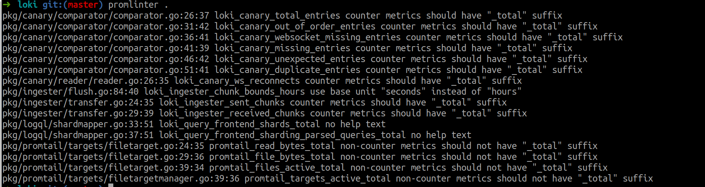

# promlinter

A linter for checking Prometheus metrics name via promlint.



## Installation

### Build from source

#### Requirements

- Go >= 1.13
- make

``` bash
git clone https://github.com/yeya24/promlinter.git
make build
```

Then you can find the `promlinter` binary file in the `./bin` directory.

### Download from release

TBD

## Usage

``` bash
promlinter -h
usage: promlinter [<flags>] [<files>...]

Prometheus metrics linter tool for golang.

Flags:
  -h, --help     Show context-sensitive help (also try --help-long and --help-man).
      --version  Show application version.
      --strict   Strict mode. If true, linter will output more issues including parsing failures.

Args:
  [<files>]  Files to lint.

```

## Run tests

``` bash
make test
```
